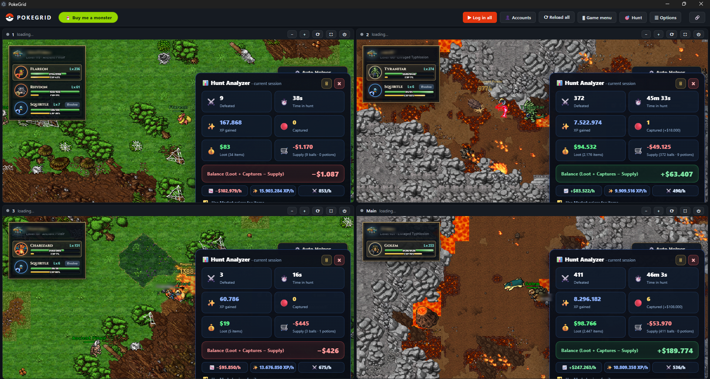

<div align="center">


# PokeGrid

**Quatro contas de Poke Idle World em uma janela só.**


[](LICENSE)

[English](README.en.md)



</div>

> Esta é a versão que roda a partir do código. Não tem executável pronto pra baixar: você pega o código, olha o que ele faz e roda você mesmo. Assim a confiança fica com você, não comigo.

> 🔰 **Nunca mexeu com isso?** Tem um passo a passo pra leigo aqui: **[TUTORIAL.md](TUTORIAL.md)** (ou o arquivo `COMO USAR.txt` dentro da pasta).

> ### 🔒 Seus dados de login ficam só no seu computador
> Login e senha são criptografados no seu próprio PC e nunca saem dele. Nada de servidor, nada de repositório. O código está todo aqui pra você conferir.

## O que é

Quatro contas rodando ao mesmo tempo, cada uma no seu quadrante e com sessão separada. Você salva o login uma vez e o app entra sozinho nas próximas. Se a sessão cair no meio do farm, ele loga de novo sem você precisar estar por perto. Ele não automatiza o jogo nem toca no captcha, só organiza as contas que você já tem.

## Como rodar

Você precisa do Node.js instalado uma vez. Depois é rápido.

**1. Instale o Node.js**
Baixe a versão LTS em [nodejs.org](https://nodejs.org) e instale (é next, next, finish).

**2. Baixe este código**
Clique no botão verde **Code** aqui em cima e depois em **Download ZIP**. Extraia a pasta onde quiser. Quem usa Git pode clonar:

```bash
git clone https://github.com/soufoka/PokeGrid-source.git
```

**3. Abra o app**
No Windows, dê dois cliques no arquivo **Abrir PokeGrid** (`.vbs`) dentro da pasta. Na primeira vez ele instala o necessário e abre sozinho; nas próximas abre na hora, sem janela preta. Quer um atalho? Botão direito nele, **Enviar para: Área de trabalho (criar atalho)**.

Também dá pra usar o **iniciar.bat**, mas ele mantém uma janela preta aberta e, se ela for fechada, o app fecha junto.

No macOS ou Linux, abra o terminal na pasta e rode:

```bash
bash iniciar.sh
```

Pronto. Entre ou crie uma conta em cada painel e, em "Treinadores", salve o login. Da próxima vez ele entra sozinho.

## O que ele faz

- Rode 2, 3 ou 4 contas, você escolhe quantos painéis abrir.
- Login automático, mesmo quando a sessão expira no meio do farm.
- Modo Eco que segura o uso de CPU sem atrapalhar o progresso.
- Esconde o chat e o menu de ícones do jogo pra sobrar tela.
- Avisa por notificação quando uma conta cai ou fica sem pokébola.
- Liga e desliga cada painel, zoom, tela cheia e atalhos de teclado.
- Bandeja, iniciar junto com o Windows e idioma português ou inglês.

## Segurança

- As senhas são criptografadas pelo `safeStorage` do Electron, que usa a API do sistema (DPAPI no Windows). Nunca saem do PC.
- Os painéis ficam presos ao domínio do jogo. Link externo abre no seu navegador, e a senha só é digitada na tela de login oficial.
- Câmera, microfone, localização e notificações do jogo ficam bloqueados.
- O captcha é sempre você que resolve. O app preenche e aperta Entrar quando você marca a caixinha, mas nunca toca no "Confirme que é humano". Burlar detecção de bot não é a proposta.

## Por dentro

Cada painel é um `<webview>` do Electron com partição própria (`persist:conta1` até `conta4`), e é isso que mantém as contas isoladas e logadas entre aberturas. O que o jogo não oferece, o app injeta em cada painel: o Eco troca o `requestAnimationFrame` por uma versão mais lenta, o login preenche pelo setter nativo do input, e o menu e o chat somem via CSS com um `MutationObserver`. Está tudo em `main.js`, `preload.js` e `index.html`, sem nada escondido.

## Licença

MIT. Projeto independente, sem ligação com o Poke Idle World.
